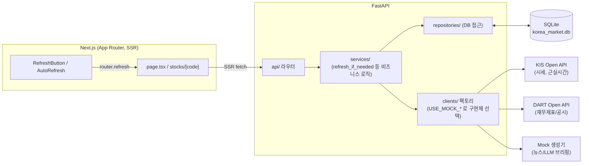

# Korea Market Intelligence

KOSPI/KOSDAQ(및 미국 NYSE/NASDAQ)을 실시간에 가깝게 분석·시각화하는 웹 기반 금융 데이터 플랫폼.
한국투자증권(KIS)·DART·네이버 뉴스 API를 붙여 시세/재무제표/공시/뉴스를 한 화면에서 보여주고,
수급·밸류 스크리너와 종목별 AI 브리핑까지 제공합니다.

## 주요 기능

- 실시간에 가까운 KOSPI/KOSDAQ/NYSE/NASDAQ 시세, 업종별 등락 Market Map, Market Movers(상승/하락/거래대금/거래량/외국인·기관 순매수 TOP)
- 종목 상세: 캔들차트(일/주/월봉 + 이동평균), DART/SEC 기반 재무제표·업종 평균 대비 밸류에이션·분기 실적 추이, 최근 공시, 관련 뉴스
- 수급+기술적 스크리너, 밸류/퀄리티 스크리너 (조건 커스터마이즈 가능)
- 종목 검색(전종목), 관심종목(워치리스트, 브라우저 로컬 저장)
- AI 시장/종목 브리핑 — 현재는 규칙 기반 Mock 템플릿으로 문장을 조립하며, 숫자는 전부 백엔드가 계산한 값을 그대로 서술합니다 (LLM 실연동은 아직 미구현)
- 시세 미연동 상태에서도 전 기능이 동작하도록 KOSPI/KOSDAQ 69종목 + 미국 55종목 규모의 Mock 데이터 세트를 제공

## 기술 스택

- Backend: Python 3.12, FastAPI, SQLAlchemy, Pydantic, httpx, SQLite
- Frontend: Next.js(App Router), React, TypeScript, Tailwind CSS, recharts, lightweight-charts
- 데이터 소스: 한국투자증권 Open API(시세), DART Open API(재무제표/공시), 네이버 뉴스 검색 API

## 아키텍처



Service 계층이 데이터 신선도를 판단해 필요할 때만 외부 API를 호출하고(Mock은 하루 단위, 실 KIS는
`KIS_REFRESH_INTERVAL_SECONDS` 단위), Repository/Client는 이 판단을 모른 채 각자 역할(DB 접근/외부
호출)만 합니다. `USE_MOCK_*` 플래그로 기능별 Mock↔실데이터 전환이 각각 독립적으로 가능합니다.

## 폴더 구조

```text
korea-market-intelligence/
├── backend/
│   ├── app/
│   │   ├── main.py          # FastAPI 엔트리포인트
│   │   ├── config.py        # 환경변수 기반 설정
│   │   ├── database.py      # SQLAlchemy 엔진/세션
│   │   ├── api/              # FastAPI 라우터 (market/stocks/sectors/flows/company/events)
│   │   ├── clients/          # 시세/기업/뉴스/브리핑 데이터 소스 (Mock ↔ 실제 KIS·DART 공용 인터페이스)
│   │   ├── services/         # 비즈니스 로직 (신선도 판단, 스키마 조립)
│   │   ├── repositories/     # DB 접근 계층
│   │   ├── models/           # SQLAlchemy 모델
│   │   ├── schemas/          # Pydantic 응답 스키마
│   │   └── analysis/         # 순수 계산 함수 (등락률/거래량비율/업종집계/랭킹/재무비율)
│   ├── tests/                # pytest (분석/클라이언트/API/Repository·Service 테스트)
│   ├── requirements.txt
│   └── .env.example
├── frontend/
│   ├── app/
│   │   ├── page.tsx          # Dashboard
│   │   └── stocks/[code]/    # 종목 상세 페이지
│   ├── components/           # MarketOverview/MarketMap/SectorTable/MoneyFlow/MarketMovers/
│   │                          # CompanyFinancials/DisclosureList/NewsList/AiBrief/SearchBar/StockChart 등
│   ├── lib/api.ts, format.ts
│   └── types/market.ts
└── data/                      # SQLite DB 파일 + KIS 토큰/종목 마스터 캐시
```

## API 엔드포인트

| Method | Path | 설명 |
| --- | --- | --- |
| GET | `/health` | 서버/DB 상태 확인 |
| GET | `/api/market/overview?country=` | 지수 + 투자자별 순매수 + 총 거래대금 |
| GET | `/api/stocks?market=&country=&sort_by=` | 종목 목록 |
| GET | `/api/stocks/search?q=&limit=&country=` | 종목 검색 |
| GET | `/api/stocks/{code}` | 종목 상세 |
| GET | `/api/stocks/{code}/chart?period=&count=` | 기간별 OHLCV (캔들차트용) |
| GET | `/api/stocks/movers?category=&market=&country=&limit=` | Market Movers |
| GET | `/api/sectors?market=&country=&sort_by=` | 업종별 집계 |
| GET | `/api/flows?market=&country=&top_n=` | 투자자별 자금 흐름 |
| GET | `/api/stocks/{code}/financials` | 재무제표 + PER/PBR/ROE/EPS/BPS |
| GET | `/api/stocks/{code}/financials/history?count=` | 분기별 실적 추이 |
| GET | `/api/stocks/{code}/financials/peer-comparison` | 업종 평균 대비 밸류에이션 |
| GET | `/api/stocks/{code}/disclosures?count=` | 최근 공시 |
| GET | `/api/stocks/{code}/news?count=` | 종목 관련 최근 뉴스 |
| GET | `/api/market/brief?country=` / `/api/stocks/{code}/brief` | AI 시장/종목 브리핑 |
| GET | `/api/events?count=&country=` | 시총 상위 종목 공시 모음 |
| GET | `/api/screener?...` | 수급+기술적 스크리너 (조건 커스터마이즈) |
| GET | `/api/screener/value?market=&country=&limit=` | 밸류/퀄리티 스크리너 |

## 실행 방법

### Backend

```bash
cd backend
python3 -m venv venv
source venv/bin/activate
pip install -r requirements.txt
cp .env.example .env   # 필요한 API 키 입력
uvicorn app.main:app --reload --port 8000
```

- 헬스체크: http://localhost:8000/health
- API 문서(Swagger): http://localhost:8000/docs

### Frontend

```bash
cd frontend
npm install
cp .env.example .env.local
npm run dev
```

- Dashboard: http://localhost:3000

## 테스트

```bash
cd backend && source venv/bin/activate && python -m pytest -q   # 218개, 전부 네트워크 Mock
cd frontend && npm test                                          # 57개
```

## 환경변수

`backend/.env.example`:

```text
KIS_APP_KEY=
KIS_APP_SECRET=
KIS_BASE_URL=https://openapi.koreainvestment.com:9443  # 모의투자: openapivts:29443
USE_MOCK_DATA=true   # false로 바꾸면 KISClient로 실제 시세를 조회한다
KIS_REFRESH_INTERVAL_SECONDS=30
DART_API_KEY=
DART_BASE_URL=https://opendart.fss.or.kr/api
USE_MOCK_DART=true
NAVER_CLIENT_ID=
NAVER_CLIENT_SECRET=
USE_MOCK_NEWS=true
LLM_API_KEY=
USE_MOCK_LLM=true    # 현재 Mock만 구현됨 (false로 바꾸면 NotImplementedError)
DATABASE_URL=sqlite:///../data/korea_market.db
```

`frontend/.env.example`:

```text
NEXT_PUBLIC_API_URL=http://localhost:8000
```

실제 API Key는 `.env`/`.env.local`에만 작성하며 git에 커밋하지 않습니다.

## 알려진 한계

- **AI 브리핑은 Mock까지만 구현**되어 있습니다. 어떤 LLM API를 쓸지 아직 정하지 않아 실제 연동은 보류 중이며, `USE_MOCK_LLM=false`로 바꾸면 `NotImplementedError`가 발생합니다.
- **KOSPI/KOSDAQ 지수는 KIS 공식 지수 API 실패 시 시가총액 가중평균 추정치로 폴백**합니다 — 폴백이 걸리면 거래소 공식 지수와 다를 수 있습니다(`data_source: kis_estimated`).
- **값이 없으면 추정하지 않고 `N/A`로 남깁니다** (예: 20일 평균거래량은 KIS 응답에 없어 항상 N/A).
- **DB는 SQLite 단일 파일**이라 동시 쓰기 내성이 낮고, 인메모리 락/캐시는 워커별로 따로 생깁니다 — 수평 확장 시 PostgreSQL + 분산 락/캐시로 교체가 필요합니다.
- **DART 공시 목록은 페이지네이션이 없어** 최대 50건까지만 조회됩니다.

## 개발 원칙

- 실제 금융 데이터를 우선 사용하고, API가 없는 기능은 Mock Data로 먼저 구현한다.
- 금융 데이터 계산은 Python(Backend)에서 수행하며, LLM은 계산된 데이터의 해석/요약만 담당한다.
- API Key는 Frontend에 절대 노출하지 않는다.
- 데이터가 없으면 임의의 값을 생성하지 않고 `N/A`로 표시한다.
- 외부 API 오류가 발생해도 전체 서비스가 중단되지 않도록 한다.
