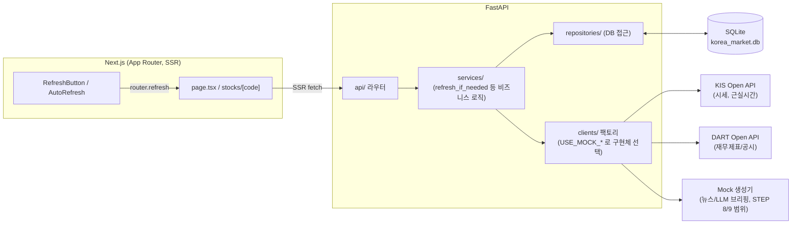

# Korea Market Intelligence

KOSPI/KOSDAQ 시장을 실시간에 가깝게 분석/시각화하는 웹 기반 금융 데이터 분석 플랫폼.

> 현재 **STEP 12 (문서화)** 완료 상태입니다. 정의된 12단계 로드맵을 모두 마쳤습니다.

## 기술 스택

- Backend: Python 3.12, FastAPI, SQLAlchemy, Pydantic, httpx
- Frontend: Next.js (App Router), React, TypeScript, Tailwind CSS, recharts, lightweight-charts(캔들차트)
- Database: SQLite (개발) → PostgreSQL (확장 예정)

## 폴더 구조

```text
korea-market-intelligence/
├── backend/
│   ├── app/
│   │   ├── main.py          # FastAPI 엔트리포인트
│   │   ├── config.py        # 환경변수 기반 설정
│   │   ├── database.py      # SQLAlchemy 엔진/세션
│   │   ├── api/                # FastAPI 라우터 (market/stocks/sectors/flows/company/events)
│   │   ├── clients/             # 시세/기업/뉴스/브리핑 데이터 소스 (Mock/실제 KIS·DART 공용
│   │   │                         # 인터페이스, 뉴스·LLM 브리핑은 STEP 8/9 기준 Mock만 구현;
│   │   │                         # stock_master.py는 검색/Movers용 전종목 코드 마스터)
│   │   ├── services/            # 비즈니스 로직 (Refresh-if-stale, 스키마 조립)
│   │   ├── repositories/        # DB 접근 계층 (Stock/MarketIndex/CompanyFinancials upsert·조회)
│   │   ├── models/               # SQLAlchemy 모델 (Stock, MarketIndex, CompanyFinancials)
│   │   ├── schemas/              # Pydantic 응답 스키마
│   │   ├── analysis/             # 순수 계산 함수 (등락률/거래량비율/업종집계/랭킹/재무비율)
│   │   └── utils/                # 공용 유틸 (추후 구현)
│   ├── tests/                   # pytest (분석/클라이언트/API 테스트 + Repository·Service 테스트, STEP 11)
│   ├── requirements.txt
│   └── .env.example
├── frontend/
│   ├── app/
│   │   ├── page.tsx             # Dashboard (AI Brief 히어로 + Market Overview/Map/Sector/Flow/Movers)
│   │   ├── stocks/[code]/       # 종목 상세 페이지 (브리핑 STEP 9 히어로, 재무제표/공시 STEP 7, 뉴스 STEP 8)
│   │   └── layout.tsx
│   ├── components/              # MarketOverview/MarketMap/SectorTable/MoneyFlow/MarketMovers/
│   │                             # CompanyFinancials/DisclosureList/NewsList/AiBrief/MarketEvents/
│   │                             # RefreshButton/AutoRefresh (STEP 10, *.test.tsx는 STEP 11+)
│   │                             # SearchBar/StockChart (전종목 검색·캔들차트, 로드맵 완료 기준 보완)
│   ├── lib/api.ts, format.ts    # Backend API 호출 및 포맷 헬퍼 (format.test.ts는 STEP 11)
│   ├── types/market.ts          # 공용 타입
│   └── vitest.config.mts        # Vitest 설정 (STEP 11)
└── data/                        # SQLite DB 파일 + KIS 토큰/종목 마스터 캐시 위치
```

## 아키텍처 (STEP 12)



- **요청 경로**: 브라우저는 Next.js가 서버에서 렌더한 HTML을 받는다(SSR) — 클라이언트에서 별도로
  API를 호출하지 않는다. `RefreshButton`/`AutoRefresh`(STEP 10)는 `router.refresh()`로 같은
  서버 컴포넌트를 다시 실행시켜 최신 데이터를 다시 SSR로 받아온다.
- **Service 계층이 신선도를 책임진다**: API 라우터는 항상 `refresh_if_needed()`를 거친 뒤 DB를
  읽는다. Mock 모드는 "오늘 데이터가 있는가"로, 실 KIS 모드는 "N초 이내에 갱신됐는가"로 신선도
  기준이 다르다(STEP 4/10 개선, 위 "시세 갱신 정책" 참고). Repository/Client는 이 판단을 모르고
  각자의 역할(DB 접근/외부 API 호출)만 한다.
- **Mock ↔ 실제 전환은 팩토리 하나로 끝난다**: `USE_MOCK_DATA`/`USE_MOCK_DART`/`USE_MOCK_NEWS`/
  `USE_MOCK_LLM` 각각이 독립적으로 구현체를 고른다. `USE_MOCK_NEWS=false` + `NAVER_CLIENT_ID`/
  `NAVER_CLIENT_SECRET`를 채우면 `NaverNewsClient`(네이버 뉴스 검색 API)로 전환된다. LLM은
  아직 Mock만 구현되어 있어 `false`로 바꾸면 `NotImplementedError`가 난다(STEP 9 범위 밖).

## 알려진 제약사항

- **AI 브리핑은 Mock까지만 구현됨**: `USE_MOCK_LLM`을 `false`로 바꾸면 즉시
  `NotImplementedError`가 발생한다. 어떤 LLM API를 쓸지 정해지지 않아 의도적으로 이후
  STEP으로 미뤘다.
- **KOSPI/KOSDAQ 지수는 평소엔 KIS 공식 지수 API(`inquire-index-price`)를 쓰지만**
  (`data_source=kis`), 이 API 호출이 실패하는 순간에 한해 종목별 시가총액 가중평균으로 만든
  자체 추정치로 폴백한다(`data_source=kis_estimated`) — 폴백이 걸렸다면 한국거래소가
  발표하는 공식 지수와 다를 수 있다.
- **KIS가 제공하지 않는 필드는 `N/A`(null)로 남긴다** — 예: 실 KIS 현재가 조회 응답에는 20일
  평균거래량이 없다. 값을 추정해서 채우지 않는다(개발 원칙 참고). 외국인/기관/개인 순매수는
  별도 API(`inquire-investor`)로 채우지만, 이 API 자체가 실패하면(예: 5xx 재시도 소진) 해당
  종목만 N/A로 남는다.
- **DB는 SQLite 단일 파일**이며 동시 쓰기 내성이 낮다. `market_service`의 싱글플라이트 락과
  `DartClient`의 공시 캐시(`_disclosure_cache`)는 둘 다 프로세스 메모리에 있는 상태라, 여러
  워커/인스턴스로 수평 확장하면 공유되지 않고 워커마다 따로 생긴다 — 프로덕션 확장 시
  PostgreSQL + 분산 락/캐시(예: Redis)로 교체가 필요하다.
- **DART 공시 목록은 페이지네이션이 없다** — `count` 파라미터로 최대 50건까지만 조회 가능하다.

## Mock Data 설계

- `USE_MOCK_DATA=true`(기본값)일 때 `MockMarketDataClient`가 `app/clients/mock_universe.py`에
  정의된 실제 KOSPI/KOSDAQ 종목 69개(시가총액 기준 50개 이상)를 기반으로 매일 새로운 가상 시세를
  생성한다. 종목코드/기업명/업종은 실제와 동일하지만 **가격·등락률·거래량·투자자 수급은 모두
  가상의 값**이며 실제 시세를 반영하지 않는다.
- 업종별로 공통된 등락 흐름(sector bias) + 개별 노이즈를 섞어서, Sector Analysis/Money Flow가
  "오늘은 반도체가 강하고 조선이 약하다" 같은 그럴듯한 하루치 시나리오를 갖도록 설계했다.
- 등락률/시가총액/거래대금/거래량비율 등은 하드코딩하지 않고 `app/analysis/`의 순수 함수로
  계산한다 — 이 함수들은 나중에 KIS 실데이터가 들어와도 그대로 재사용된다.
- Repository/Service는 Mock인지 실제 API인지 알지 못한다 (`app/clients/get_market_data_client()`
  팩토리가 `settings.use_mock_data`에 따라 구현체만 교체). STEP 4에서 `KISClient`를 추가하면
  Service/API 계층은 수정하지 않아도 된다.
- Sector 집계는 별도 테이블에 저장하지 않고 Stock 테이블에서 매 요청 시 계산한다 (이중 관리
  방지). 업종별 시가총액 가중평균 방식이며, 실제 KOSPI/KOSDAQ 지수 산출식과는 다른 자체
  추정치임을 코드 주석에 명시했다.

## Market Map (STEP 3)

- `recharts`의 `Treemap` 컴포넌트(squarified 알고리즘)로 교체하여 타일 면적이 시가총액
  비중에 실제로 비례하도록 구현했다 (STEP 2의 flexbox 근사 그리드는 폐기).
- 타일 색상은 등락률 기준 히트맵(`lib/format.ts`의 `heatColor`, 빨강 상승/파랑 하락)을 그대로
  재사용한다.
- Hover 시 `Tooltip` 커스텀 컨텐츠로 종목명/코드/현재가/등락률/시가총액/거래대금/거래량/
  외국인·기관 순매수를 표시하고, 타일 클릭 시 `/stocks/{code}` 상세 페이지로 이동한다
  (`onClick` 핸들러에서 `next/navigation`의 `router.push` 사용).
- KOSPI/KOSDAQ 토글과 종목 검색(이름/코드)은 클라이언트 상태로 필터링하며, 두 기능 모두
  기존 `/api/stocks` 응답을 재사용하므로 추가 API 호출이 없다.

## KIS API 연동 (STEP 4)

- `USE_MOCK_DATA=false`로 설정하면 `KISClient`(`app/clients/kis_client.py`)가 한국투자증권
  Open API 실전투자 서버(`KIS_BASE_URL`, 기본값 실전투자)에서 실제 시세를 가져온다.
  Mock과 동일한 `MarketDataClient` 인터페이스를 구현하므로 Service/Repository/API 계층은
  전혀 수정하지 않았다.
- KIS 현재가 조회(`inquire-price`, tr_id `FHKST01010100`)는 종목을 하나씩 조회하는 구조라
  `mock_universe.STOCK_UNIVERSE`의 종목코드 69개를 순차 호출한다. 호출 사이 0.15초 간격을
  두고, 일시적인 5xx 오류는 최대 3회까지 짧은 backoff 후 재시도한다 — 그래도 실패하면 해당
  종목만 이번 갱신에서 건너뛴다(전체 서비스는 중단되지 않음).
- OAuth2 액세스 토큰은 발급 빈도 제한(분당 1회 수준)을 피하기 위해 `data/kis_token_cache.json`에
  캐시하고, 만료 10분 전부터 재발급한다.
- **KIS 현재가 조회 응답에는 20일 평균거래량이 포함되지 않는다.** 이 값을 추정해서 채우면
  "데이터가 없으면 N/A로 표시하고 사실을 지어내지 않는다"는 개발 원칙을 어기게 되므로,
  `RawStock`에서 `avg_volume_20d`를 `None`으로 남긴다 — 그 결과 Market Movers의
  `거래량 급증` 카테고리는 KIS 데이터일 때 비어 있다(순위를 지어내지 않음). 외국인/기관/
  개인 순매수는 원래 이 자리에도 N/A로 뒀었지만, 이후 별도 API로 채웠다 — 아래 "실제
  지수·투자자매매동향 연동" 참고.
- KOSPI/KOSDAQ 지수는 이제 KIS가 제공하는 공식 지수 조회 API(`inquire-index-price`)를 우선
  사용한다(`data_source: "kis"`). 이 API 호출이 실패할 때만 방금 조회한 종목들의 시가총액
  가중평균 등락률로 추정한 값을 폴백으로 쓴다(`data_source: "kis_estimated"`) — 아래 참고.
- 테스트(`tests/test_kis_client.py`)는 `httpx.MockTransport`로 실제 네트워크 호출 없이
  토큰 발급/시세 파싱/재시도/N/A 처리를 검증한다. `tests/conftest.py`는 로컬 `.env`의
  `USE_MOCK_DATA` 값과 무관하게 테스트를 항상 Mock으로 강제해, 실제 API 키가 설정된
  개발 환경에서도 테스트가 외부 API를 호출하지 않도록 했다.

### 시세 갱신 정책 (STEP 10에서 개선)

STEP 4를 처음 붙였을 때는 `refresh_if_needed()`가 "오늘 날짜 데이터가 DB에 있으면
그대로 반환"하는 하루 1회 기준이었다 — Mock이 "하루치 시나리오"를 한 번만 생성하도록
설계된 것과 맞물려 있었는데, `USE_MOCK_DATA=false`로 실제 KIS를 붙여도 이 기준을
그대로 물려받아 하루 안에는 새로고침을 아무리 눌러도 값이 안 바뀌는 문제가 있었다
(STEP 10에서 새로고침 버튼을 만들다가 발견). 그래서 신선도 판단을 다음과 같이 데이터
소스별로 분리했다(`app/services/market_service.py`):

- **Mock**: 기존과 동일하게 UTC 기준 오늘 하루 단위로 판단한다 (매일 새 시나리오,
  같은 날 안에서는 하루치 스토리가 흔들리지 않도록).
- **KIS(실 데이터)**: `KIS_REFRESH_INTERVAL_SECONDS`(기본 30초)가 지나면 갱신 대상으로
  본다.
- KIS 현재가 조회는 69종목을 순차 호출해야 해서 한 번 갱신하는 데 십수 초가 걸린다.
  이미 데이터가 있는 상태(콜드스타트가 아님)에서 갱신이 필요해지면, 그 요청을 붙잡아두지
  않고 **백그라운드 스레드**에서 KIS를 호출하며 이번 요청은 기존(최대
  `KIS_REFRESH_INTERVAL_SECONDS`초 정도 오래된) 데이터를 즉시 반환한다
  (stale-while-revalidate 방식). 서버가 막 시작해 DB가 완전히 비어 있는 콜드스타트만
  예외적으로 동기 대기한다.
- 대시보드 SSR 한 번에 시세 관련 엔드포인트가 여러 개(overview/stocks/sectors/flows/
  movers×6) 동시에 호출되므로, 모두가 "오래됐다"고 동시에 판단해 KIS를 중복 호출하지
  않도록 프로세스 전역 락(`threading.Lock`, non-blocking)으로 한 번에 하나의 갱신만
  허용한다 — 락을 못 잡은 요청은 그냥 기존 데이터로 응답한다.
- 실제 KIS 키로 확인한 결과: `/api/stocks/005930` 요청은 캐시가 오래된 상태에서도
  51ms만에 기존 데이터로 응답했고, 이후 첫 갱신 요청이 백그라운드에서 삼성전자
  270,000원(+5.68%)을 정상적으로 받아와 `data_source: "kis"`로 갱신했다. 프론트엔드
  라벨은 "MOCK DATA"에서 "실시간"으로 자동 전환된다.

### 실제 지수·투자자매매동향 연동 (로드맵 완료 기준 보완)

STEP 4를 처음 붙였을 때는 KOSPI/KOSDAQ 지수를 자체 가중평균으로 추정했고
(`data_source: "kis_estimated"`), 외국인/기관/개인 순매수는 KIS 현재가 조회 응답에
없어서 항상 N/A였다. 대시보드를 실 KIS 모드로 띄워보니 지수가 실제 값과 크게 어긋나고
순매수 카드가 전부 비어 있는 게 눈에 띄어(사용자 확인), KIS가 별도로 제공하는 공식
API 두 개를 마저 연동했다.

- **API 명세는 추측하지 않는다는 원칙에 따라**, 한국투자증권 공식 GitHub
  저장소(`koreainvestment/open-trading-api`)의 예제 코드에서 정확한 endpoint/TR_ID를
  확인했다:
  - 국내업종 현재지수: `GET /uapi/domestic-stock/v1/quotations/inquire-index-price`,
    TR_ID `FHPUP02100000`, `FID_INPUT_ISCD`는 코스피 `0001`/코스닥 `1001`.
  - 주식현재가 투자자(종목별 외국인/기관/개인 순매수): `GET
    /uapi/domestic-stock/v1/quotations/inquire-investor`, TR_ID `FHKST01010900`.
    이 API는 종목별로 최근 거래일들을 리스트로 반환하며(최신순), 첫 번째 행을 쓴다.
- **순매수 거래대금 필드의 단위는 문서에 없어서 실 서버에 라이브로 호출해 검증했다.**
  같은 날 같은 종목(005930)의 `frgn_ntby_qty`(순매수 수량, 3,246,247주)×종가(270,000원)
  ≈ 8,765억원과 `frgn_ntby_tr_pbmn`(871,112) 값을 대조한 결과 약 100만 배 차이가 나
  **백만원 단위**임을 확인했다(× 1,000,000 = 8,711억원, 오차 1% 이내 — 장중 체결가
  변동을 감안하면 합리적). `inquire-price`의 `acml_tr_pbmn`(원 단위, 배율 없음)과는
  단위가 다르므로 상수(`_INVESTOR_UNIT_MULTIPLIER`)로 분리해 착각을 방지했다.
- `KISClient.fetch_stocks()`가 종목마다 시세 조회 뒤 투자자매매동향도 함께 조회해
  `RawStock.foreign_net_buy`/`institution_net_buy`/`individual_net_buy`를 채운다 —
  종목당 API 호출이 1개에서 2개로 늘어 전체 갱신 시간이 늘지만(69종목 기준 약 10초 →
  약 21초), 이미 구현된 stale-while-revalidate 덕분에 웜스타트에서는 백그라운드에서
  처리되고 사용자 요청은 즉시 기존 캐시로 응답한다.
  `market_service.get_market_overview()`의 `foreign_net_buy_total` 등 합계는 이미
  `sum_optional_by`로 종목별 값을 더하고 있었으므로, 종목 데이터가 채워지자 자동으로
  함께 채워졌다(별도 로직 추가 불필요). `MarketIndexOut`(KOSPI/KOSDAQ 카드 단위)의
  순매수 필드도 같은 방식으로 채운다.
- `KISClient.fetch_market_indices()`는 이제 `inquire-index-price`를 우선 호출하고
  (`data_source: "kis"`), 실패할 때만 기존 가중평균 추정치로 폴백한다
  (`data_source: "kis_estimated"`) — 지수 API 하나가 죽어도 전체 대시보드가 멎지 않게
  하기 위함이다.
- 실제 KIS 키로 확인한 결과(2026-09-07): KOSPI 6,995.39(+4.61%), KOSDAQ
  822.19(+1.07%), 외국인 순매수 2.3조원/기관 2.2조원/개인 -6.1조원으로 대시보드가
  정상 표시됨을 Playwright 스크린샷으로 확인했다. Market Movers의 `외국인 순매수`/
  `기관 순매수` TOP 10과 Money Flow의 업종별·종목별 TOP 리스트도 함께 채워졌다.
- 테스트: `tests/test_kis_client.py`에 `_parse_index_output`(부호 처리 포함),
  `_fetch_investor`/`_fetch_index_quote` 재시도 성공/포기, 지수 API 실패 시 추정치
  폴백, 투자자매매동향 단위 변환 검증을 추가했다 (총 9개, 기존 KIS 테스트 11개와
  합쳐 19개; Backend 전체 132개).

## DART 연동 (STEP 7)

- `USE_MOCK_DART=false`로 설정하면 `DartClient`(`app/clients/dart_client.py`)가 금융감독원
  DART(전자공시시스템) Open API에서 실제 기업 재무제표/공시를 가져온다. KIS 연동(`USE_MOCK_DATA`)과
  독립된 플래그로 관리한다 — 두 외부 API는 서로 다른 시점에 키가 준비될 수 있으므로 기능별로
  각각 Mock/실데이터를 선택할 수 있게 했다. 기본값은 `true`(Mock)이며, Mock/실제 구현체 모두
  `DartDataClient` 인터페이스(`fetch_financials`/`fetch_disclosures`)를 공유하므로 Service 계층은
  어떤 구현체인지 모른다.
- DART API는 종목코드가 아니라 8자리 `corp_code`를 요구한다. 전체 회사 목록(`corpCode.xml`, zip)을
  1회 다운로드해 `data/dart_corp_code_map.json`에 종목코드→corp_code 매핑으로 캐시하고, 7일 이상
  지나면 재다운로드한다 (KIS 토큰 캐시와 동일한 파일 캐시 패턴).
- 재무제표는 `fnlttSinglAcnt.json`(단일회사 주요계정)으로 조회한다 — 계정과목이 "자산총계"/
  "부채총계"/"자본총계"/"매출액"/"영업이익"/"당기순이익"처럼 표준화되어 있어 전체 계정과목보다
  파싱이 안정적이다. 아직 공시되지 않은 최근 분기는 DART가 "013"(데이터없음)을 반환하므로, 당해년도
  최근 분기부터 과거 방향(3분기→반기→1분기→전년도 사업보고서→...)으로 후보를 순회해 첫 성공을
  채택한다. 조회 결과는 `CompanyFinancials` 테이블에 종목당 1행으로 캐시하고, `Stock`과 동일하게
  "오늘 이미 갱신했으면 스킵"하는 day 단위 신선도 체크를 재사용한다.
- **PER/PBR/ROE/EPS/BPS는 DART가 직접 제공하지 않는다.** `app/analysis/financial_analysis.py`의
  순수 함수가 `Stock.price`/`market_cap`(KIS/Mock 시세)과 `CompanyFinancials.net_income`/
  `total_equity`(DART 재무제표)를 조합해 요청 시점에 계산한다. 적자 기업처럼 비율이 의미가 없는
  경우(EPS·BPS≤0) 0으로 지어내지 않고 N/A로 남긴다.
- 최근 공시 목록(`list.json`, 최근 90일)은 시세처럼 자주 바뀌는 데이터가 아니라 "최신순 조회"이므로
  DB에 영속화하지 않고 요청마다 라이브 호출한다.
- Mock 재무제표(`MockDartClient`)는 날짜가 아니라 종목코드로만 시드를 고정해, 하루가 지나도 같은
  값을 반환한다(재무제표는 시세처럼 일별로 바뀌지 않는 게 맞음). Mock 공시는 실제로 존재하지 않는
  `rcept_no`로 가짜 DART 링크를 만들지 않기 위해 `url`을 `null`로 둔다 — 프론트엔드는 이 경우 링크
  없이 텍스트만 표시한다.
- 테스트(`tests/test_dart_client.py`)는 `httpx.MockTransport`로 corp_code zip 파싱, 재무제표
  연도/보고서코드 폴백, 공시 파싱(정상/013)을 네트워크 없이 검증한다. `conftest.py`는
  `USE_MOCK_DART` 값도 항상 `true`로 강제해 테스트가 실제 DART API를 호출하지 않도록 한다.

## 뉴스 연동 (STEP 8, STEP 17에서 실 연동 추가)

- 종목 상세 페이지에 해당 종목 관련 최근 뉴스 목록을 추가했다. `NewsDataClient` 인터페이스
  (`fetch_news`)를 KIS/DART와 동일한 패턴으로 정의하고, `MockNewsClient`와 실제 구현체인
  `NaverNewsClient`(네이버 뉴스 검색 API, `app/clients/naver_news_client.py`)가 이를 공유한다.
  `USE_MOCK_NEWS=false` + `NAVER_CLIENT_ID`/`NAVER_CLIENT_SECRET`를 채우면 실제 뉴스로
  전환된다. 2026-07-31부로 네이버가 검색 API를 개발자센터(developers.naver.com)에서
  네이버클라우드플랫폼의 "NAVER API HUB"(`naverapihub.apigw.ntruss.com`)로 이관해,
  신규 발급은 `console.ncloud.com` 가입 -> NAVER API HUB -> Search API 신청 경로로만
  가능하다(개발자센터 "사용 API" 목록에는 더 이상 검색이 없음). 엔드포인트 경로
  (`/news.json` -> `/search/v1/news`)와 인증 헤더(`X-Naver-Client-Id/Secret` ->
  `X-NCP-APIGW-API-KEY-ID`/`X-NCP-APIGW-API-KEY`)만 바뀌었고 요청 파라미터·응답 필드는
  동일하다.
- `NaverNewsClient`는 종목코드를 그대로 검색어로 쓸 수 없으므로(네이버 뉴스 검색은 자유
  텍스트 쿼리) `stock_master`(전종목 코드/종목명 마스터)에서 종목명을 찾아 그 이름으로
  검색한다. 응답의 title은 검색어를 `<b>` 태그로 감싸고 HTML 엔티티로 이스케이프하므로
  화면에 노출하기 전에 벗겨낸다. 언론사명은 API가 별도로 주지 않아 "네이버뉴스"로 표시한다.
- 재무제표(날짜 무관, 종목코드로만 시드)와 달리 Mock 뉴스는 매일 새로 나오는 데이터이므로,
  `MockNewsClient`는 `MockMarketDataClient`와 동일하게 종목코드 + 오늘 날짜로 시드를 섞는다 —
  같은 날 여러 번 조회하면 동일한 결과, 날짜가 바뀌면 헤드라인 구성도 바뀐다.
- 공시와 동일한 이유로 DB에 영속화하지 않고 요청마다 즉시 생성/조회한다. Mock 헤드라인은
  종목명/업종을 섞은 템플릿 풀에서 뽑으며, 실제로 존재하지 않는 기사 URL을 지어내지 않기
  위해 `url`은 항상 `null`이다 — 프론트엔드는 이 경우 링크 없이 텍스트만 표시한다
  (`DisclosureList`와 동일 패턴).
- 테스트(`tests/test_mock_news_client.py`, `tests/test_naver_news_client.py`)는 알려진/알 수
  없는 종목코드, count 제한, 같은 날 안정성(같은 시드 재현), HTML 태그/엔티티 제거, 팩토리의
  Mock/실제 분기, 자격증명 누락 시 예외를 검증한다. `conftest.py`는 `USE_MOCK_NEWS`도 기본
  `true`로 강제해 테스트가 실제 네이버 API를 호출하지 않도록 한다.

## AI Market Brief (STEP 9)

- 대시보드와 종목 상세 페이지에 각각 "오늘의 시장 요약"/"이 종목 요약" 브리핑을 추가했다. STEP 8과
  같은 이유로 **이번 STEP 범위도 Mock까지다** — `LLM_API_KEY`만 있고 어떤 LLM 공급자를 쓸지 아직
  정해지지 않아 실제 연동은 이후 STEP으로 미뤘다 (사용자 확인 완료).
  `BriefDataClient` 인터페이스(`generate_market_brief`/`generate_stock_brief`)만 정의해두고,
  `MockLLMClient` 구현체만 우선 붙였다. `USE_MOCK_LLM=false`로 바꾸면 `get_llm_client()`가
  `NotImplementedError`를 던진다 (뉴스와 동일한 원칙).
  개발 원칙("금융 데이터 계산은 Python에서 수행하고 LLM은 해석/요약만 담당")에 따라, 실제 LLM을
  붙이더라도 지수·업종·재무비율 등 숫자는 Service 계층이 이미 계산해 넘겨준 값을 그대로 서술하고,
  LLM(현재는 Mock 템플릿)은 그 값을 문장으로 조립하는 역할만 한다.
- `MockLLMClient`는 `MarketOverviewOut`/`SectorOut`(시장 브리핑)과 `StockOut`/
  `CompanyFinancialsOut`/`NewsItemOut`(종목 브리핑)을 입력받아, 실제 계산된 숫자를 그대로 문장에
  꽂아 넣는다 — 등락률/PER/ROE 등 어떤 값도 새로 지어내지 않는다. 재무·뉴스 데이터가 없으면
  "N/A" 문장으로 대체한다.
- 종목명 등 동적으로 들어가는 단어에 자연스러운 조사(은/는, 이/가)가 붙도록 한글 받침 유무를
  판별하는 헬퍼(`_josa`)를 사용한다 (예: "삼성전자는", "전자부품이").
- DB에 영속화하지 않고 요청마다 즉시 생성한다 (공시/뉴스와 동일한 이유). 브리핑 생성이 실패해도
  전체 API가 죽지 않도록 try/except로 감싸고 "브리핑을 생성하지 못했습니다 (N/A)" 문장으로
  대체한다.
- 테스트(`tests/test_mock_llm_client.py`)는 시장/종목 브리핑 문장 조립, 빈 업종 리스트/재무·뉴스
  없음 처리, 조사 선택 정확성, 팩토리의 Mock/미구현 분기를 검증한다. `conftest.py`는
  `USE_MOCK_LLM`도 항상 `true`로 강제한다.

## Dashboard 통합 (STEP 10)

STEP 1~9는 기능을 하나씩 세로로 쌓기만 했고, 화면 간 흐름이나 데이터 신선도는 다루지 않았다.
STEP 10은 새 API를 추가하지 않고 이미 있는 화면 두 개(대시보드/종목 상세)를 하나의 제품처럼
묶는 데에 집중했다.

- **AI 브리핑을 히어로 위치로 이동**: `AiBrief`는 원래 각 페이지 맨 아래에 있었다. 브리핑은
  나머지 섹션(지수/업종/재무/공시/뉴스)의 요약이므로, 요약을 먼저 보고 필요하면 아래로
  내려가 근거를 확인하는 순서가 자연스럽다고 판단해 헤더 바로 아래로 옮겼다.
- **`RefreshButton`**: 대시보드/종목 상세 헤더에 배치된 클라이언트 컴포넌트. 클릭하면
  `router.refresh()`로 서버 컴포넌트를 다시 렌더해 최신 Mock 시세를 가져온다. 마지막
  새로고침 시각은 최초 클릭 전까지 표시하지 않는다 (SSR과 클라이언트의 최초 렌더 시각이
  달라 하이드레이션 불일치가 나는 것을 피하기 위함).
- **`AutoRefresh`**: 화면에 아무것도 그리지 않는 클라이언트 컴포넌트. 마운트되면 60초 간격으로
  `router.refresh()`를 호출해, 사용자가 아무것도 하지 않아도 "실시간에 가깝게" 데이터가
  갱신되도록 한다. `lib/api.ts`의 모든 GET 요청이 `cache: "no-store"`이므로 새로고침될 때마다
  최신 Mock 시세를 다시 받아온다.
- **종목 간 이동 경로 재확인**: Market Map(타일 클릭), Market Movers(종목명 링크)는 이미
  `/stocks/{code}`로 연결되어 있었다. Sector Table은 업종 단위 집계라 종목 상세로 연결할
  대상이 없어 그대로 두었다.
- 새 백엔드 로직은 없으므로 기존 93개 테스트에는 변화가 없다. 프론트엔드는 `tsc --noEmit`,
  `eslint`로 검증했고, dev 서버를 띄워 대시보드/종목 상세 페이지의 SSR 응답에서 브리핑이
  각 섹션보다 먼저 나오는지, 새로고침 버튼이 렌더되는지 확인했다.

## 테스트 (STEP 11)

STEP 10까지는 새 화면/기능을 추가할 때 그 범위의 테스트만 같이 작성했다. STEP 11은 기능 추가
없이, 지금까지 커버리지가 비어 있던 두 영역을 채우는 데 집중했다.

- **Backend: Repository/Service 레이어**. STEP 4/10 개선(근실시간 KIS 갱신)에서 추가한
  `MarketRepository`/`StockRepository`의 `has_any()`/`is_fresh_since()`, 그리고
  `market_service.refresh_if_needed()`의 신선도 판단·싱글플라이트 락·
  stale-while-revalidate 백그라운드 스레드 분기는 클라이언트/분석 로직 테스트와 달리
  전혀 테스트되지 않은 채로 남아 있었다. 이 경로는 동시성이 얽혀 있어 이 프로젝트에서
  가장 깨지기 쉬운 코드였다. `tests/test_market_repository.py`,
  `tests/test_stock_repository.py`, `tests/test_market_service.py`를 추가해 Mock/실
  KIS 모드별 신선도 기준, 콜드스타트 동기 조회, 웜스타트 백그라운드 조회, 락이 이미
  걸려 있을 때 스킵하는 동작을 각각 검증한다.
- **버그 발견 및 수정**: `is_fresh_since()` 테스트를 작성하는 과정에서 실제 버그를 하나
  찾았다. SQLite는 `DateTime(timezone=True)` 컬럼도 tzinfo 없이(naive) 반환하는데, 기존
  코드는 이 naive 값에 `.astimezone(timezone.utc)`를 그대로 호출하고 있었다 — naive
  datetime을 "시스템 로컬 시간"(서버가 한국에 있다면 KST, UTC+9)으로 오인해 9시간 어긋난
  값으로 변환하는 것이 Python 표준 동작이다. 그 결과 실 KIS 모드에서는 방금 갱신한 데이터도 항상
  "9시간 지난 데이터"로 보여 매 요청마다 불필요한 재조회가 발생했을 것이다 (싱글플라이트
  락 덕분에 중복 호출까지는 아니었지만, 30초 캐시가 사실상 전혀 동작하지 않는 상태).
  naive 값은 UTC로 간주하도록(`replace(tzinfo=...)`) 두 리포지토리를 모두 수정했다.
- **Frontend: 테스트 프레임워크 도입**. 기존에 프론트엔드에는 테스트가 전혀 없었다.
  Vitest + Testing Library(+ jsdom)를 추가하고, 순수 로직인 `lib/format.ts`(등락 색상/
  단위 변환/히트맵 색상 등)와 STEP 10에서 추가한 `RefreshButton`/`AutoRefresh`(새로고침
  클릭 시 `router.refresh()` 호출, 하이드레이션 불일치 방지, 60초 자동 새로고침, 언마운트
  시 타이머 정리)를 테스트했다.
- 최종 결과: Backend 113개(기존 93 + 신규 20), Frontend 23개, 전부 통과. `npm run lint`,
  `npx tsc --noEmit`도 통과 확인.

## DART Events (로드맵 완료 기준 보완)

12단계 로드맵을 다 마친 뒤, 원본 기획서의 완료 기준 체크리스트를 다시 대조하는 과정에서 빠진
항목을 발견했다: 대시보드에 "여러 종목의 최근 공시를 모아 보여주는" KEY EVENTS 카드가 없었다
(STEP 7은 종목 상세 페이지의 공시 목록만 구현했음).

- **`GET /api/events`**: 시가총액 상위 15개 종목 각각에서 최근 공시 3건씩을 모아
  `rcept_dt` 기준 최신순으로 정렬해 상위 N건을 반환한다. 전체 69개 종목을 다 조회하면 실
  DART 기준 순차 호출이 너무 많아지므로, 대시보드가 이미 주목하고 있는 시가총액 상위
  종목으로 범위를 좁혔다.
- 종목 하나의 공시 조회가 실패해도(`RawDisclosure` fetch 예외) 그 종목만 건너뛰고 나머지는
  정상적으로 모은다 — 기존 서비스들과 동일한 "부분 실패해도 전체는 안 죽는다" 원칙.
- 프론트엔드 `MarketEvents` 컴포넌트는 종목명(종목 상세 페이지 링크)과 공시 제목(DART 원문
  링크, Mock은 URL 없음)을 함께 보여주며, 대시보드의 Market Movers 아래에 배치했다.
- 테스트: `tests/test_event_service.py`(정렬/개수 제한/부분 실패 처리/data_source 판별),
  `tests/test_api.py::test_events_endpoint`, `components/MarketEvents.test.tsx` 추가.
  Backend 118개, Frontend 27개로 늘었다.

## Frontend 테스트 보강 (로드맵 완료 기준 보완)

STEP 11에서 추가한 프론트엔드 테스트는 순수 유틸과 컴포넌트 2개뿐이었다. 원본 기획서
26번(Frontend Test)이 명시한 "Dashboard 렌더링 / Market Map 렌더링 / 종목 클릭 / 필터 작동 /
API 오류 UI" 다섯 항목을 기준으로 보면 부족했다.

- **`components/MarketMap.test.tsx`**: recharts의 `Treemap`/`ResponsiveContainer`는 jsdom에서
  실제 크기(ResizeObserver 기반)를 계산하지 못해 타일을 전혀 그리지 않는다. 시각화 자체가
  아니라 "MarketMap이 올바른 데이터를 필터링해서 넘기고 클릭 콜백을 올바르게 연결하는가"가
  검증 대상이므로, `recharts`를 "data로 받은 항목마다 버튼 하나"로 단순화한 스텁으로
  교체했다. KOSPI/KOSDAQ 필터, 종목명/코드 검색, 빈 결과 상태, 타일 클릭 시
  `router.push("/stocks/{code}")` 호출을 검증한다.
- **`app/page.test.tsx`**: `DashboardPage`는 async Server Component라 훅이 없으므로
  `render(await DashboardPage())`로 바로 렌더링할 수 있었다. `@/lib/api`를 모킹해 (1) 모든
  API가 성공하면 8개 섹션이 전부 렌더되는지, (2) 한 섹션의 API 호출만 실패해도(예:
  `getMarketOverview` reject) 해당 섹션만 "불러올 수 없습니다 (N/A)" 문구로 대체되고 나머지
  섹션은 정상 렌더되는지(부분 실패 격리) 검증한다. `MarketMap`/`RefreshButton`/`AutoRefresh`는
  각자 이미 별도 테스트가 있고 여기서는 대시보드 조립 로직만 보면 되므로 얇은 스텁으로
  대체했다.
- 최종 결과: Frontend 27개 → 36개.

## API 안정성/캐싱 보강 (로드맵 완료 기준 보완)

기획서 23번(API 안정성)/24번(캐싱) 기준으로 KIS 클라이언트는 이미 재시도/백오프/요청 간격
제어를 갖추고 있었지만, DART 클라이언트는 없었다. 또한 공시 목록(`/disclosures`, `/events`)은
캐시 없이 매 요청마다 DART를 라이브 호출하고 있어, 60초 `AutoRefresh`와 15개 종목을 순회하는
`GET /api/events`가 겹치면 실 DART 모드에서 호출량이 빠르게 늘어나는 구조였다.

- **`DartClient._get_with_retry`**: KIS의 `_fetch_quote` 재시도 정책(5xx만 최대 3회, 매 시도
  사이 0.5초 × 시도 횟수만큼 대기, 4xx는 즉시 포기)을 DART에도 그대로 적용했다. 재무제표
  조회(`_fetch_finstate_rows`)와 공시 목록 조회(`fetch_disclosures`)가 이 공통 메서드를
  공유한다. KIS 코드 자체는 이미 테스트가 있는 안정된 경로라 손대지 않았다.
- **공시 목록 3분 캐시**: `DartClient` 인스턴스는 `get_dart_client()`가 요청마다 새로 만들기
  때문에(위 아키텍처 다이어그램 참고) 인스턴스 필드로는 캐시가 요청 간에 살아남지 못한다.
  그래서 `(stock_code, count)`를 키로 하는 모듈 전역 딕셔너리에 3분 TTL로 캐시했다 — 프로세스
  안에서는 여러 `DartClient` 인스턴스가 이 캐시를 공유한다. 재무제표처럼 DB에 영속화하지 않은
  이유는 그대로다(최신순 조회라 upsert 대상이 아님); 이건 어디까지나 반복 호출을 줄이기 위한
  메모리 캐시다. 여러 워커로 확장하면 워커별로 캐시가 따로 생기는 한계는 위 "알려진
  제약사항"에 적었다.
- 테스트: `tests/test_dart_client.py`에 재시도 성공/포기/4xx 무재시도, 캐시 히트(다른
  `DartClient` 인스턴스에서도 네트워크를 타지 않는지 실패하는 트랜스포트로 확인)/캐시 만료 후
  재조회 6개를 추가했다 (총 123개).

## 전종목 Movers/검색/차트 (사용자 피드백 반영)

사용자가 대시보드를 직접 써보고 세 가지를 지적했다: (1) 상승률/하락률 TOP10에 상한가/하한가
종목이 안 보인다 - `mock_universe.STOCK_UNIVERSE`(약 70종목)로만 순위를 계산했기 때문이다,
(2) 기업 검색창이 없다, (3) 종목별 캔들/이동평균 차트가 없다.

- **Market Movers가 전체 시장 기준으로 바뀜**: KIS는 전체 종목을 한 번에 내려주는 API가 없어
  `fetch_stocks()`는 여전히 큐레이션된 유니버스만 순회하지만, KIS "순위분석" API(등락률
  `/ranking/fluctuation`, 거래량순위 `/quotations/volume-rank`, 국내기관_외국인
  매매종목가집계 `/quotations/foreign-institution-total`)는 종목 유니버스와 무관하게 시장
  전체를 대상으로 한다. `MarketDataClient.fetch_movers()`를 새로 추가해 `top_gainers`/
  `top_losers`/`top_trading_value`/`foreign_net_buy`/`institution_net_buy`는 이 API들로
  채우고, `volume_surge`(순위 API의 "거래증가율" 응답이 ETN/ETF 이상치에 지배돼 신뢰할 수
  없음)만 기존 큐레이션 유니버스 기반 계산으로 폴백한다(Mock 클라이언트는 기본 구현이 항상
  `None`을 반환해 전부 폴백 - Mock 유니버스 자체가 이미 "전체"이므로 문제없다).
  - **`fid_input_cnt_1`(조회 개수) 파라미터 함정**: 라이브 호출로 확인한 결과, 이 값이 문서
    설명과 달리 단순 개수 제한이 아니라 서버가 반환하는 30건짜리 결과 "묶음" 자체를 바꿨다
    ("0"을 주면 오늘의 최대 하락 종목 -29.98%가 응답에서 아예 빠지고, "5"/"10"/"30"을 주면
    포함됨). 값 하나로는 상/하한가를 안정적으로 잡을 수 없어, `{5, 10, 30}` 세 값으로 나눠
    호출한 뒤 합쳐서 서버가 매긴 순서를 신뢰하지 않고 검증된 필드(`prdy_ctrt`)로 직접
    재정렬한다.
  - `FID_TRGT_EXLS_CLS_CODE`로 ETF/ETN을 제외해, 레버리지/인버스 상품이 상하위권을 뒤덮지
    않고 개별 종목(주식) 위주로 나오게 했다.
  - 순위 API로 채운 종목은 업종/거래대금(등락률·순매수 카테고리)/시가총액을 제공하지 않아
    `StockOut.sector`/`market_cap`/`trading_value`가 `null`일 수 있다 - 값을 지어내지 않고
    N/A로 남긴다(`Stock` 프론트 타입도 이에 맞춰 nullable로 변경).
- **종목 검색(`GET /api/stocks/search?q=`)**: KOSPI+KOSDAQ 전종목(약 4,400개, ETF/ETN
  포함) 코드/종목명 검색. KIS API에는 종목명 검색 엔드포인트가 없어, KIS 공식 예제
  (`stocks_info/kis_{kospi,kosdaq}_code_mst.py`)와 같은 방식으로 정적 마스터 파일
  (`kospi_code.mst.zip`/`kosdaq_code.mst.zip`, cp949 고정폭 텍스트)을 내려받아 코드/종목명만
  추출한다(`app/clients/stock_master.py`). 하루 단위로 `data/stock_master.json`에 캐시하고,
  Movers가 시장 전체 API로 채워질 때 종목코드 -> 시장(KOSPI/KOSDAQ) 역조회에도 이 목록을
  쓴다. 코드 완전일치 -> 이름 시작 -> 이름 포함 -> 코드 포함 순으로 우선순위를 둔다.
- **유니버스 밖 종목 단건 조회**: 검색으로 큐레이션된 유니버스 밖 종목(예: 삼성전자우)을
  선택해도 상세 페이지가 404가 되지 않도록, `StockRepository`에 없으면
  `MarketDataClient.fetch_single_stock()`으로 즉시 조회해 DB에 채운 뒤 반환한다(KIS는
  `inquire-price` 단건 조회 + stock_master로 종목명/시장을 채움, Mock은 자체 유니버스에서
  찾아 없으면 여전히 404).
- **종목별 차트(`GET /api/stocks/{code}/chart?period=D&count=`)**: KIS
  "국내주식기간별시세(일/주/월/년)"(`/quotations/inquire-daily-itemchartprice`)로 OHLCV를
  받아온다. 실전계좌 기준 한 번의 호출로 최대 100건까지만 조회되는 제약이 있어 `count`를
  100으로 캡핑한다. Mock은 종목코드+기간을 시드로 한 재현 가능한 랜덤워크 캔들을 생성하되,
  마지막 봉의 종가는 대시보드에 보이는 현재가와 일치시킨다. 프론트엔드는
  `lightweight-charts`로 캔들스틱 + MA5/MA20/MA60 + 거래량 히스토그램을 그리고, 일봉/주봉/
  월봉 토글을 제공한다(`components/StockChart.tsx`).
- 테스트: `test_kis_client.py`에 `fetch_movers`(카테고리별 5종 + `volume_surge` 폴백 확인)/
  `fetch_daily_chart`/`fetch_single_stock` 7개, `test_stock_master.py`에 마스터 파일 파싱/
  검색 우선순위 9개, `test_api.py`에 검색/차트 엔드포인트 6개를 추가했다(Backend 전체 154개).
  프론트엔드는 `SearchBar.test.tsx` 3개를 추가했다(Frontend 전체 39개).

### 다크 테마 대비(색상) 버그 수정

사용자가 "글자가 옅은 흰색이라 잘 안 보인다"고 보고했다. 원인은 색상 값이 아니라 **CSS
캐스케이드 레이어 우선순위**였다: `app/globals.css`가 Next.js 기본 템플릿에서 그대로 남아있던
라이트/다크 미디어쿼리 기반 `body { background: var(--background); color: var(--foreground) }`
규칙을 `@layer` 밖(언레이어드)에 두고 있었는데, Tailwind v4 유틸리티는 `@layer` 안에서
생성되고, CSS 스펙상 언레이어드 규칙은 명시도와 무관하게 레이어 안의 규칙을 항상 이긴다. 그
결과 `app/layout.tsx`가 `<body>`에 준 `bg-black text-neutral-100`이 항상 무시되고, 실제
배경은 라이트 모드 기준 흰색인데 다크 배경을 전제로 고른 옅은 회색 글자가 그 위에 그대로
남아 거의 안 보였다(라이트/다크 토글 UI 자체가 없는, 항상 다크인 앱이라 이 변수 기반
스킴은 애초에 불필요했다). `globals.css`에서 이 규칙과 미사용 CSS 변수를 제거해 body의 배경/
글자색을 `layout.tsx`의 Tailwind 클래스가 그대로 결정하게 했다. 여기에 더해 보조 텍스트에
쓰인 `text-neutral-500`/`600`을 `300`/`400`으로 한 단계씩 올려 검은 배경 대비 대비율을
높였다.

## 밸류 스크리너 + 업종 비교 밸류에이션 + 분기 실적 추이 (사용자 피드백 반영)

사용자가 대시보드를 훑어보고 "전체적으로 빈 공간이 많다"고 지적해, 이미 갖고 있는 KIS/DART
데이터로 채울 수 있는 지표 후보를 제안한 뒤 그중 두 가지를 골라 구현했다: (1) 기존 MY
SCREENER(수급+기술적) 옆에 나란히 둘 밸류/퀄리티 스크리너, (2) 종목 상세의 재무 섹션을
보강하는 업종 평균 대비 밸류에이션 + 분기별 실적 추이.

- **밸류/퀄리티 스크리너(`GET /api/screener/value`)**: 수급 스크리너(`screener_service`)는
  시세만으로 1단계 필터링이 가능하지만, 저평가/우량 여부는 재무제표(DART)를 봐야 알 수 있어
  1단계 필터가 없다 - `market` 필터가 좁히는 범위 안의 전 종목에 대해
  `company_service.get_financials()`를 호출한다. 이 함수는 종목당 하루 1회만 실제로 DART를
  조회하고(`FinancialsRepository`의 신선도 체크) 그 외에는 DB 캐시를 쓰므로, 당일 첫 호출만
  느리고 이후 호출은 빠르다. PER 12배 미만·PBR 1.2배 미만·ROE 10%↑·영업이익률 10%↑·부채비율
  100% 미만 5가지 신호를 조합해 0~5점으로 점수를 매기고(`value_screener_analysis.
  score_value_candidate`), 값을 알 수 없는 지표는 조건 미달이 아니라 그냥 건너뛴다(N/A ≠
  조건 미충족). 2점 이상만 노출한다.
- **업종 평균 대비 밸류에이션(`GET /api/stocks/{code}/financials/peer-comparison`)**: 같은
  업종(KIS 세부 분류, 예: "반도체") 내 다른 종목들과 PER/PBR/ROE 평균을 비교한다
  (`peer_valuation_service`). 종목 상세 페이지를 열 때마다 호출되므로 스크리너처럼 우주
  전체를 훑을 수는 없어, 동료 종목 수를 15개로 제한해 DART 호출 비용을 억제한다. 업종이
  "미분류"이거나 재무제표가 없으면 404를 반환한다(지어내지 않음).
- **분기별 실적 추이(`GET /api/stocks/{code}/financials/history?count=`)**: 기존
  `DartClient.fetch_financials`는 최신 분기 하나만 반환했다. 후보 보고서 시점 목록
  (`candidate_report_periods`, 기존 `DartClient._candidate_periods`를 모듈 함수로 추출해
  실 클라이언트와 Mock 클라이언트가 공유)을 그대로 여러 번 순회해 성공한 분기를 최대
  `count`개까지 모으고, 시간이 왼쪽에서 오른쪽으로 흐르도록 오래된 분기 -> 최신 분기 순으로
  뒤집어 반환하는 `fetch_financials_history`를 새로 추가했다. 종목당 최대 `count`회의
  재무제표 조회가 필요해 공시 캐시(3분)보다 긴 30분 TTL의 모듈 전역 캐시를 둔다. 프론트엔드는
  `EarningsTrend.tsx`에서 recharts `BarChart`로 매출액/영업이익을 그린다.
- 프론트엔드: `ValueScreener.tsx`(대시보드, `Screener` 옆 2단 배치), `PeerValuation.tsx`·
  `EarningsTrend.tsx`(종목 상세, `CompanyFinancials` 다음)를 신설했다.
- 테스트: `value_screener_analysis`/`value_screener_service`/`peer_valuation_service` 단위
  테스트, `fetch_financials_history`(실 클라이언트 순서·캐싱, Mock 클라이언트 안정성) 테스트,
  API 엔드포인트 통합 테스트(총 25개 추가, Backend 전체 213개)를 추가했다. 프론트엔드는
  `ValueScreener.test.tsx`/`PeerValuation.test.tsx`/`EarningsTrend.test.tsx`를 신설하고
  `page.test.tsx`를 갱신했다(Frontend 전체 57개).

## DART 실 연동 활성화 + 거래량 급증 TOP10 교체 (사용자 피드백 반영)

사용자가 대시보드에 남은 Mock 표시와 거래량 급증 TOP10의 "데이터 없음"을 지적했다.

- **DART 실 연동 활성화**: `DART_API_KEY`를 발급받아 `.env`에 등록하고
  `USE_MOCK_DART=false`로 전환했다. 이미 오늘 자로 Mock 재무제표가 `CompanyFinancials`
  테이블에 69종목 캐시되어 있어(day 단위 신선도 체크가 "오늘 이미 갱신함"으로 판단),
  키를 바꾼 뒤에도 그대로 서빙되는 문제가 있었다 - `data_source='mock'`인 캐시 행을 지워
  다음 요청부터 실제 DART가 다시 채우도록 했다. RECENT DISCLOSURES/COMPANY FINANCIALS/
  PEER VALUATION/EARNINGS TREND 전부 `data_source: "dart"`로 전환됨을 라이브 호출로
  확인했다. 뉴스(`USE_MOCK_NEWS`)는 네이버 API 키가 아직 없어 Mock으로 남아있다 - 키
  발급 후 동일한 방식으로 전환 가능하다.
- **거래량 급증 TOP10 → 거래량 TOP10**: `volume_surge`(20일 평균거래량 대비 배율)는 KIS
  어떤 API에도 진짜 N일 평균거래량 필드가 없어 항상 빈 목록이었다(`MOVER_CATEGORIES`가
  `avg_volume_20d=None`인 종목을 순위에서 제외 -> 전 종목 제외). 라이브 호출로 대안을
  검증했다: 거래량순위 API(`/quotations/volume-rank`)의 `avrg_vol`(평균거래량) 필드는
  `acml_vol`(당일 누적거래량)과 항상 동일한 값을 반환하는 허수 필드였고, `vol_inrt`
  (거래증가율)는 삼미금속 등에서 9999.99배로 튀는 이상치가 실제로 확인됐다(기존 코드
  주석의 "ETN/ETF 이상치로 신뢰 불가" 판단이 맞았음). 대신 같은 엔드포인트가 안정적으로
  제공하는 **당일 거래량 절대량**(`FID_BLNG_CLS_CODE="0"`, `acml_vol` 내림차순)으로
  카테고리를 교체했다 - 거래대금(원화 금액) TOP10과는 다른 지표라 중복도 아니다. 카테고리
  키를 `volume_surge` -> `top_volume`으로, 라벨을 "거래량 급증 TOP 10" -> "거래량 TOP 10"으로
  바꿨다(백엔드 5개 파일 + 프론트엔드 4개 파일 + README, 관련 테스트도 함께 갱신 -
  Backend/Frontend 테스트 총 개수는 213/57로 변동 없음, rename이라 순증가 없음).
  - MY SCREENER(수급+기술적)의 "거래량 급증" 신호(`score_candidate`의
    `volume_surge_threshold`)도 같은 이유로 KIS 실데이터에서는 항상 미충족 상태다 - 이번
    작업 범위에는 포함하지 않았고, 4개 신호 중 1개가 항상 빠진 채 최대 3점까지만 나온다는
    점을 기록해둔다.

## 종목 상세 수급 데이터 버그 수정 + MY SCREENER 조건 커스터마이즈 (사용자 피드백 반영)

사용자가 종목 상세 페이지에서 외국인/기관 순매수가 안 뜨는 문제와, 대시보드 MY SCREENER가
항상 빈 화면인 문제를 지적했다.

- **종목 상세 외국인/기관 순매수 null 버그**: Market Movers(대시보드)는 정상 표시되는데
  종목 상세만 null이었다. 원인은 `KISClient._fetch_investor()`(`kis_client.py`)가
  `inquire-investor` 응답의 `output[0]`(당일/최신 행)만 사용했는데, 장중에는 당일 행의
  `frgn_ntby_tr_pbmn` 등 필드가 빈 문자열(`""`)로 온다는 점이었다(장 종료 후에만 확정 값이
  채워짐) - `float("")`가 `ValueError`를 던져 조용히 `None`을 반환했다. 스크리너용
  `fetch_investor_history()`는 행마다 개별 try/except로 스킵하게 되어 있어 이 버그의 영향을
  받지 않았다(그래서 스크리너/무버스는 멀쩡했음). 수정: 세 필드가 모두 정상 파싱되는
  가장 최신 행을 찾도록 변경(빈 값이면 전일 행으로 폴백). 부수 효과로 MY SCREENER의 1단계
  필터(오늘 외국인+기관 동시 순매수) 후보 풀도 늘었다.
- **MY SCREENER 조건 커스터마이즈**: 기존에는 조건(연속 순매수 3일 이상·거래량 20일 평균
  대비 1.5배 이상·이동평균 정배열 필수 여부·최소 점수)이 하드코딩되어 있어 오늘처럼 시장이
  순매도 우세면 후보가 0개로 빈 화면만 나왔고, 사용자가 조절할 방법이 없었다.
  `GET /api/screener`에 `streak_threshold`/`volume_surge_threshold`/`require_both`
  (외국인·기관 동시 순매수 vs 둘 중 하나)/`min_score` 쿼리 파라미터를 추가하고, 프론트
  `Screener.tsx`를 클라이언트 컴포넌트로 바꿔 "조건 조절하기" 폼(연속일수/거래량 배수/
  동반매수 여부/최소 점수 입력)에서 즉시 재조회할 수 있게 했다. 서버에서 내려준 기본 조건
  결과를 초기값으로 쓰고, 폼에서 조건을 바꿔 "조건 적용"을 누르면 브라우저가 백엔드를 직접
  호출해 결과를 갱신한다.

## API 엔드포인트

| Method | Path | 설명 |
| --- | --- | --- |
| GET | `/health` | 서버/DB 상태 확인 |
| GET | `/api/market/overview` | KOSPI/KOSDAQ 지수 + 투자자별 순매수 + 총 거래대금 |
| GET | `/api/stocks?market=&sort_by=` | 종목 목록 (Market Map/전체 조회용) |
| GET | `/api/stocks/search?q=&limit=` | 종목 검색 (KOSPI+KOSDAQ 전종목, 코드/종목명) |
| GET | `/api/stocks/{code}` | 종목 상세 (유니버스 밖 종목은 단건 조회로 즉시 채움) |
| GET | `/api/stocks/{code}/chart?period=&count=` | 종목 기간별 시세(일/주/월/년봉 OHLCV, 캔들차트용) |
| GET | `/api/stocks/movers?category=&market=&limit=` | Market Movers - 전체 시장 기준(top_gainers/top_losers/top_trading_value/top_volume/foreign_net_buy/institution_net_buy) |
| GET | `/api/sectors?market=&sort_by=` | 업종별 집계 |
| GET | `/api/flows?market=&top_n=` | 투자자별 자금 흐름 (업종/종목 TOP N) |
| GET | `/api/stocks/{code}/financials` | 기업 재무제표 + PER/PBR/ROE/EPS/BPS (STEP 7) |
| GET | `/api/stocks/{code}/financials/history?count=` | 최근 N개 분기 매출액/영업이익/당기순이익 추이 |
| GET | `/api/stocks/{code}/financials/peer-comparison` | 같은 업종 내 PER/PBR/ROE 평균 비교 |
| GET | `/api/stocks/{code}/disclosures?count=` | 최근 공시 목록 (STEP 7) |
| GET | `/api/stocks/{code}/news?count=` | 종목 관련 최근 뉴스 (STEP 8, STEP 17에서 네이버 뉴스 실연동) |
| GET | `/api/market/brief` | 시장 전체 AI 브리핑 (STEP 9, 현재 Mock만 구현) |
| GET | `/api/stocks/{code}/brief` | 종목별 AI 브리핑 (STEP 9, 현재 Mock만 구현) |
| GET | `/api/events?count=` | 시가총액 상위 종목들의 최근 공시 모음 (DART Events) |
| GET | `/api/screener?market=&limit=&streak_threshold=&volume_surge_threshold=&require_both=&min_score=` | 수급+기술적 스크리너 (조건 커스터마이즈 가능) |
| GET | `/api/screener/value?market=&limit=` | 밸류/퀄리티 스크리너 |

## 실행 방법

### Backend

```bash
cd backend
python3 -m venv venv
source venv/bin/activate
pip install -r requirements.txt
cp .env.example .env   # 필요한 API 키 입력
uvicorn app.main:app --reload --port 8000
```

- 헬스체크: http://localhost:8000/health
- API 문서(Swagger): http://localhost:8000/docs

### Frontend

```bash
cd frontend
npm install
cp .env.example .env.local
npm run dev
```

- Dashboard: http://localhost:3000

## 테스트

```bash
cd backend
source venv/bin/activate
python -m pytest -q
```

분석 함수(등락률/거래량비율/업종집계/재무비율) 단위 테스트, API 엔드포인트 테스트, KIS
클라이언트 테스트(토큰 발급/시세 파싱/재시도/N/A 처리/실 지수·투자자매매동향 파싱/단위 변환),
DART 클라이언트 테스트(corp_code 매핑/재무제표 폴백/공시 파싱/재시도/캐싱), Mock 뉴스
클라이언트 테스트(시드 안정성/팩토리 분기), Mock LLM 브리핑 클라이언트 테스트(문장 조립/N/A
처리/조사 선택), Repository/Service 레이어 테스트(데이터 신선도 판단, 싱글플라이트 락,
백그라운드 갱신 분기), DART Events 집계 테스트(정렬/개수 제한/부분 실패 처리), 전체 시장
Movers/차트/단건조회(`fetch_movers`/`fetch_daily_chart`/`fetch_single_stock`)와 종목 마스터
파싱/검색 테스트, 수급/밸류 스크리너와 업종 비교 밸류에이션/분기별 실적 추이 테스트를
포함한다 (총 218개, 전부 네트워크 Mock).

```bash
cd frontend
npm test
```

순수 유틸(`lib/format.ts`), 클라이언트 컴포넌트(`RefreshButton`, `AutoRefresh`, `MarketEvents`,
`MarketMap`, `SearchBar`, `DailyPriceTable`), 서버 컴포넌트(`ValueScreener`, `PeerValuation`,
`EarningsTrend`), Dashboard 조립 로직(`app/page.tsx`, API 부분 실패 시 섹션별 폴백 포함)을
Vitest + Testing Library로 검증한다 (총 57개).

## 환경변수

`backend/.env.example` 참고:

```text
KIS_APP_KEY=
KIS_APP_SECRET=
KIS_BASE_URL=https://openapi.koreainvestment.com:9443  # 모의투자: openapivts:29443
USE_MOCK_DATA=true   # false로 바꾸면 KISClient로 실제 시세를 조회한다
KIS_REFRESH_INTERVAL_SECONDS=30   # 실 KIS 사용 시 이 초가 지나면 백그라운드에서 재조회한다
DART_API_KEY=
DART_BASE_URL=https://opendart.fss.or.kr/api
USE_MOCK_DART=true   # false로 바꾸면 DartClient로 실제 재무제표/공시를 조회한다
NAVER_CLIENT_ID=
NAVER_CLIENT_SECRET=
NEWS_API_KEY=
USE_MOCK_NEWS=true   # false + NAVER_CLIENT_ID/SECRET로 바꾸면 NaverNewsClient로 실제 뉴스를 조회한다
LLM_API_KEY=
USE_MOCK_LLM=true    # 현재 Mock만 구현됨 (false로 바꾸면 NotImplementedError, STEP 9 범위 밖)
DATABASE_URL=sqlite:///../data/korea_market.db
```

`frontend/.env.example` 참고:

```text
NEXT_PUBLIC_API_URL=http://localhost:8000
```

실제 API Key는 `.env`/`.env.local`에만 작성하며 git에 커밋하지 않습니다 (`.gitignore`에 포함됨).

## 개발 원칙

- 실제 금융 데이터를 우선 사용하고, API가 없는 기능은 Mock Data로 먼저 구현한다.
- 금융 데이터 계산은 Python(Backend)에서 수행하며, LLM은 계산된 데이터의 해석/요약만 담당한다.
- API Key는 Frontend에 절대 노출하지 않는다.
- 데이터가 없으면 임의의 값을 생성하지 않고 `N/A`로 표시한다.
- 외부 API 오류가 발생해도 전체 서비스가 중단되지 않도록 한다.

## 개발 단계 (STEP)

- [x] STEP 1 — 프로젝트 초기화
- [x] STEP 2 — Mock Data
- [x] STEP 3 — Market Map
- [x] STEP 4 — KIS API 연동
- [x] STEP 5 — Sector Analysis
- [x] STEP 6 — Market Movers
- [x] STEP 7 — DART 연동
- [x] STEP 8 — News (Mock만 구현, 실 API 연동은 이후 STEP)
- [x] STEP 9 — AI Market Brief (Mock만 구현, 실 LLM 연동은 이후 STEP)
- [x] STEP 10 — Dashboard 통합
- [x] STEP 11 — 테스트
- [x] STEP 12 — 문서화
